##  About the connector
Recorded Future's unique technology automatically serves up relevant insights in real time and at unparalleled scale. Recorded Future's flexible software lets you put any type of threat intelligence where you need it — centralizing sources of threat data, enabling collaboration on analysis, and integrating with your security infrastructure.

This document provides information about the Recorded Future connector, which facilitates automated interactions, with a Recorded Future server using CyOPs™ playbooks. Add the Recorded Future connector as a step in CyOPs™ playbooks and perform automated operations, such as looking up threat context and retrieving reputation for domains, IP addresses, files etc, and getting risk lists for domains, IP addresses, files etc based on risk list rules.

### Version information
Connector Version: 1.0.0

Compatibility with CyOPs™ Versions: 4.10.3-161 and later.

## Installing the connector

All connectors provided by  CyOPs™ are delivered using a CyOPs™ repository. Therefore, you must set up your CyOPs™ repository and use the `yum` command to install connectors:

`yum install cyops-connector-recorded-future`

To update a  CyOPs™-provided connector use the following command:

`yum update cyops-connector-recorded-future`

To remove a  CyOPs™-provided connector use the following command:

`yum remove cyops-connector-recorded-future`

The process to write your own custom connector is defined in the `Building a custom connector` topic.

## Prerequisites to configuring the connector

- You must have the URL of the Recorded Future server on which you will perform the automated operations. 
- You must have the API key that is configured for your Recorded Future account.
- To access the CyOPs™ UI, ensure that port 443 is open through the firewall for the CyOPs™ instance.

## Configuring the connector

!!! Note  
		This procedure assumes that you are using CyOPs™ version 4.10.3. If you are using a different version of CyOPs™, such as CyOPs™ 4.9, then it is possible that the CyOPs™ UI navigation is different. Refer to the CyOPs™ documentation of that particular version for details about CyOPs™ navigation.

1. In CyOPs™, on the left pane, click **Automation** > **Connectors**.   
   On the `Connectors` page, you will see the `Recorded Future` connector.
2. To configure the connector parameters, click the Recorded Future connector row to open the **Configurations** tab. Enter the required configuration details in the **Configurations** tab.   
   You must provide a name for you configuration and you can optionally check the **Mark As Default Configuration** checkbox to make the Recorded Future connector point to this configuration by default.  
   You must provide configuration parameters such as the URL of the Recorded Future server that you will connect to and perform automated operations and the API key configured for your Recorded Future account.  
   For a complete list of configuration parameters, see the [Configuration parameters](#Configuration-parameters) section.  
   **Note**: You can add multiple configurations if you have more than one Recorded Future server instances in your environment. You must, therefore, specify a unique `Name` to identify each configuration in your environment.  
   If you have previous versions of a connector and you are configuring a newer version of that connector, with the same configuration parameters, then CyOPs™ fetches the configuration and input parameters of the latest available version of that connector. For example, If you have 1.0.0, 1.1.0, and 1.2.0 versions of the Recorded Future connector and you are configuring the 1.3.0 version of the Recorded Future connector, then while configuring the 1.3.0 version,  CyOPs™ will fetch the configuration and input parameters from the 1.2.0 version of the Recorded Future connector. You can review the configuration and input parameters, and then decide to change them or leave them unchanged. 
3. To save your configuration, click **Save**.  
   To view the list of actions that can be performed by the connector, click the **Actions**
   tab.  
   To view the playbook file that is bundled with the connector, click the **Sample Playbooks** tab. Refer to the [Included Playbooks](#Included-playbooks) section for details on the bundled playbooks. You can see the bundled playbooks in the **Automation** > **Playbooks** section in  CyOPs™ after importing the Recorded Future connector.    
   Once you click **Save** the Recorded Future connector performs a health check.
4. (Optional) You can also perform the health check and check the connectivity to the Recorded Future server and validity of the credentials provided anytime, by clicking the **Refresh** icon that is present in the `Health Check` bar.  
   If all the details are correct and the Recorded Future server is available then the health check status displays as `Available`.  
   If any of the details are incorrect or the Recorded Future server is unavailable then the health check status displays as `Disconnected`.

### Configuration parameters

In CyOPs™, on the Connectors page, select the **Recorded Future** connector and click **Configure** to configure the following parameters:

| Parameter  | Description                                                  |
| ---------- | ------------------------------------------------------------ |
| Server URL | URL of the Recorded Future server from where the connector gets notifications. |
| API Key    | API Key that is configured for you to authenticate your Recorded Future account |
| Verify SSL | Specifies whether the SSL certificate for the server is to be verified or not.  By default, this option is set as `True`. |

**Note**: You can store the IDs, keys, and other confidential data using the `Secrets` store provided in CyOPs™. When you store data in the `Secrets` store, users cannot see that data. However, they can use this data when required. For more information about the `Secrets` store, see "Configuring the Secrets store" in the "Administration" guide.

## Actions supported by the connector

The following automated operations can be included in playbooks and you can also use the annotations to access operations from CyOPs™ release 4.10.0 onwards:

| Function                    | Description                                                  | Annotation and Category                    |
| --------------------------- | ------------------------------------------------------------ | ------------------------------------------ |
| Get Domain Reputation       | Looks up the intel threat context for a domain and retrieves its reputation from Recorded future, based on the domain name you have specified. | get_domain_reputation   Investigation |
| Get Domain Risk List        | Retrieves the risk list information for the domain(s) from Recorded Future, based on the risk rule list you have specified. | get_risk_list   Investigation         |
| Search Domain               | Searches for and retrieves information about intel threat context for all domains or specific domain(s) (based on the filter criteria you have specified) from Recorded Future. | search_domain   Investigation         |
| Get IP Reputation           | Looks up the intel threat context for an IP address and retrieves its reputation from Recorded Future, based on the IP address you have specified. | get_ip_reputation   Investigation     |
| Get IP Risk List            | Retrieves the risk list information for the IP address(es) from Recorded Future, based on the risk rule list you have specified. | get_risk_list   Investigation         |
| Search IP                   | Searches for and retrieves information about intel threat context for all IP addresses or specific IP address(es) (based on the filter criteria you have specified) from Recorded Future. | search_ip   Investigation             |
| Get File Reputation         | Looks up the intel threat context for a file identity hash (MD5, SHA-1 or SHA-256) and retrieves its reputation from Recorded future, based on the file hash you have specified. | get_file_reputation   Investigation   |
| Get File Risk List          | Retrieves the risk list information for the file(s) from Recorded Future, based on the risk rule list you have specified. | get_risk_list   Investigation         |
| Search Filehash             | Searches for and retrieves information about intel threat context for all filehashes or specific filehash(es) (based on the filter criteria you have specified) from Recorded Future. | search_filehash   Investigation       |
| Lookup Vulnerability        | Looks up the intel threat context for a vulnerability and retrieves its information from Recorded future, based on the CVE Identifier ID or Recorded Future ID you have specified. | get_vulnerability   Investigation     |
| Get Vulnerability Risk List | Retrieves the risk list information for the vulnerability(ies) from Recorded Future, based on the risk rule list you have specified. | get_risk_list   Investigation         |
| Search Vulnerabilities      | Searches for and retrieves information about intel threat context for all vulnerabilities or specific vulnerabilities(ies) (based on the filter criteria you have specified) from Recorded Future. | search_vulnerability   Investigation  |
| Lookup URL                  | Looks up the intel threat context for a URL and retrieves its information from Recorded future, based on the URL you have specified. | get_url_reputation   Investigation    |
| Get URL Risk List           | Retrieves the risk list information for the URL(s) from Recorded Future, based on the risk rule list you have specified. | get_risk_list   Investigation         |
| Search URL                  | Searches for and retrieves information about intel threat context for all URLs or specific URL(s) (based on the filter criteria you have specified) from Recorded Future. | search_url   Investigation            |
| Lookup Malware              | Looks up the intel threat context for a Malware and retrieves its information from Recorded future, based on the Malware ID you have specified. |                                            |
| Search Malware              | Searches for and retrieves information about intel threat context for all Malwares or specific Malware(s) (based on the filter criteria you have specified) from Recorded Future. |                                            |
| Get Alert                   | Retrieves details for an alert which is generated in Recorded Future, based on the alert ID you have specified. | get_alert   Investigation             |
| Search Alerts               | Searches for and retrieves notification information for all alerts or specific alert(s) (based on the filter criteria you have specified) generated on Recorded Future. |                                            |
| Search Alert Rules          | Searches for and retrieves information about all alert rules or specific alert rule(s) (based on the filter criteria you have specified) from Recorded Future. |                                            |
| Get Risk Rules              | Retrieves the risk rules for IP, Domain, URL, File or  Vulnerability from Recorded Future, based on the filter criteria you have specified. |                                            |

### operation: Get Domain Reputation

#### Input parameters

| Parameter | Description                                                  |
| --------- | ------------------------------------------------------------ |
| Domain    | Name of the domain for which you want to retrieve reputation from Recorded Future. |
| Fields    | (Optional) Fields that you want to include in the output. You can choose from the following options: Analysis Notes, Entity, Counts, Intel Card URL, Metrics, Related Entities, Risk, Sightings, Threat Lists, and Event Timestamps.    By default, this option is set as `Entity`. |
| Metadata  | (Optional) Select this option to annotate the response with additional metadata explaining the response data elements.   By default, this option is set as `True`. |

#### Output

The JSON output contains the reputation information for the domain retrieved from Recorded Future, based on the domain name you have specified.

Following image displays a sample output:

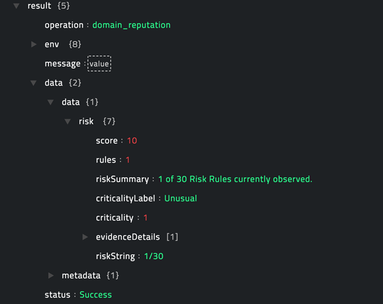

### operation: Get Domain Risk List

#### Input parameters

| Parameter      | Description                                                  |
| -------------- | ------------------------------------------------------------ |
| Risk Rule List | Risk Rule List based on which you want to retrieve risk list information for domain(s) from Recorded Future. You can choose from the following options: Historically Reported by Insikt Group, C&C Nameserver, C&C DNS Name, C&C URL, Compromised URL, Recently Resolved to Host of Many DDNS Names, Historically Reported as a Defanged DNS Names, Recent Fast Flux DNS Name, Historically Reported in Threat List, Historically Linked to Cyber Attack, Historical Malware Analysis DNS Name, Blacklisted DNS Name, Active Phishing URL, Ransomware Distribution URL, Ransomware Payment DNS Name, Recently Reported by Insikt Group, Recently Reported as a Defanged DNS Names, Recently Linked to Cyber Attack, Recent Malware Analysis DNS Name, Recent Threat Researcher, Recent Typosquat Similarity - DNS Sandwich, Recent Typosquat Similarity - Typo or Homograph, Recently Resolved to Malicious IP, Recently Resolved to Suspicious IP, Recently Resolved to Unusual IP, Recently Resolved to Very Malicious IP, Trending in Recorded Future Analyst Community, Historical Threat Researcher, Historical Typosquat Similarity - DNS Sandwich, or Historical Typosquat Similarity - Typo or Homograph. |

#### Output

The JSON output contains the risk list information for the domain(s) retrieved from Recorded Future, based on the risk rule list you have specified.

Following image displays a sample output:

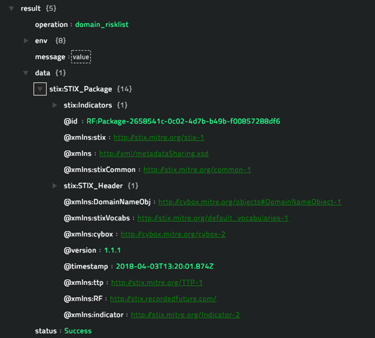

### operation: Search Domain

**Note**: All the input parameters are optional. However, if you do not specify any parameter, then no filter criteria is applied and an unfiltered list is returned. 

#### Input parameters

| Parameter  | Description                                                  |
| ---------- | ------------------------------------------------------------ |
| Fields     | Fields that you want to include in the output. You can choose from the following options: Analysis Notes, Entity, Counts, Intel Card URL, Metrics, Related Entities, Risk, Sightings, Threat Lists, and Event Timestamps.    By default, this option is set as `Entity`. |
| Metadata   | Select this option to annotate the response with additional metadata explaining the response data elements.   By default, this option is set as `True`. |
| Limit      | Maximum number of results that this operation should return.    By default, this option is set as `10`. |
| Offset     | Index of the first item to return from the search result.    |
| Risk Score | Filter the search results by the risk score, which are integer values from 0 to 100.   For example, Risk Score=[20,90] // same as 20 <= Risk Score <= 90   Risk Score=(20,90) // same as 20 <= Risk Score <= 90   Risk Score=[20,90) // same as 20 <= Risk Score <= 90   Risk Score=[20,)   // same as 20 <= Risk Score  Risk Score=[,90)   // same as Risk Score < 90 |
| First Seen | Filter the search results by the first see date (all ElasticSearch compatible date formats are valid).   For example, 2017-03-14T18:01:18.750Z, 2017-01-01, 2017/01/01 |
| Last Seen  | Filter the search results by the last see date (all ElasticSearch compatible date formats are valid).   For example, 2017-03-14T18:01:18.750Z, 2017-01-01, 2017/01/01 |
| List ID    | Vulnerability ID from Recorded Future.   For example, idn:ddobnajanu.club |
| Risk Rule  | Risk Rule List based on which you want to retrieve risk list information for domain(s) from Recorded Future. You can choose from the following options: Historically Reported by Insikt Group, C&C Nameserver, C&C DNS Name, C&C URL, Compromised URL, Recently Resolved to Host of Many DDNS Names, Historically Reported as a Defanged DNS Names, Recent Fast Flux DNS Name, Historically Reported in Threat List, Large, Historically Linked to Cyber Attack, Historical Malware Analysis DNS Name, Blacklisted DNS Name, Active Phishing URL, Ransomware Distribution URL, Ransomware Payment DNS Name, Recently Reported by Insikt Group, Recently Reported as a Defanged DNS Names, Recently Linked to Cyber Attack, Recent Malware Analysis DNS Name, Recent Threat Researcher, Recent Typosquat Similarity - DNS Sandwich, Recent Typosquat Similarity - Typo or Homograph, Recently Resolved to Malicious IP, Recently Resolved to Suspicious IP, Recently Resolved to Unusual IP, Recently Resolved to Very Malicious IP, Trending in Recorded Future Analyst Community, Historical Threat Researcher, Historical Typosquat Similarity - DNS Sandwich, or Historical Typosquat Similarity - Typo or Homograph. |
| Parent     | Filter domains (including FQDNs) in a parent domain or a subdomain. |
| Order By   | Order the search results by this filter criteria. You can choose from the following options: Created, Criticality, First Seen, Last Seen, Modified, Risk Score, Rules, Seven Days Hits, Sixty Days Hits, or Total Hits. |
| Direction  | Arrange the search results either in the  **Ascending** order or **Descending** order based on the risk score. |

#### Output

The JSON output contains information about intel threat context for all domains or specific domain(s) (based on the filter criteria you have specified) retrieved from Recorded Future.

Following image displays a sample output:

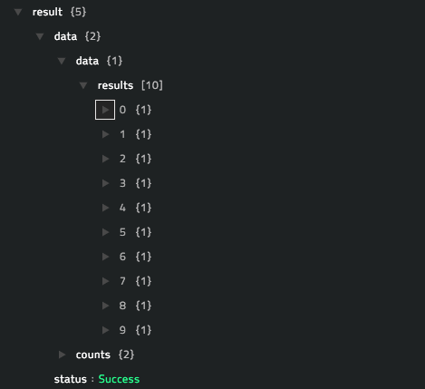

### operation: Get IP Reputation

#### Input parameters

| Parameter  | Description                                                  |
| ---------- | ------------------------------------------------------------ |
| IP Address | IP address for which you want to retrieve reputation from Recorded Future. |
| Fields     | (Optional) Fields that you want to include in the output. You can choose from the following options: Analysis Notes, Entity, Counts, Intel Card URL, Metrics, Related Entities, Risk, Sightings, Threat Lists, and Event Timestamps.    By default, this option is set as `Entity`. |
| Metadata   | (Optional) Select this option to annotate the response with additional metadata explaining the response data elements.   By default, this option is set as `True`. |

#### Output

The JSON output contains the reputation information for the IP address retrieved from Recorded Future, based on the IP address you have specified.

Following image displays a sample output:

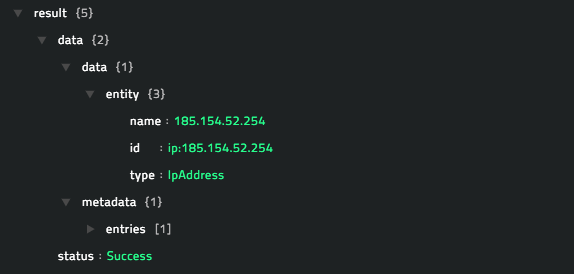

### operation: Get IP Risk List

#### Input parameters

| Parameter      | Description                                                  |
| -------------- | ------------------------------------------------------------ |
| Risk Rule List | Risk Rule List based on which you want to retrieve risk list information for IP address(es) from Recorded Future. You can choose from the following options: Historically Reported by Insikt Group, Inside Possible Bogus BGP Route, Historical Botnet Traffic, Nameserver for C&C Server, Historical C&C Server, Cyber Exploit Signal: Important, Cyber Exploit Signal: Medium, Recent Host of Many DDNS Names, Historically Reported as a Defanged IP, Resolution of Fast Flux DNS Name, Historically Reported in Threat List, Historical Honeypot Sighting, Honeypot Host, Recent C&C Server, Historically Linked to Intrusion Method, Historically Linked to APT, Historically Linked to Cyber Attack, Malicious Packet Source, Malware Delivery, Historical Multicategory Blacklist, Historical Open Proxies, Phishing Host, Historical Positive Malware Verdict, Recently Reported by Insikt Group, Recent Botnet Traffic, Current C&C Server, Recently Reported as Defanged IP, Recent Honeypot Sighting, Recently Linked to Intrusion Method, Recently Linked to APT, Recently Linked to Cyber Attack, Recent Multicategory Blacklist, Recent Open Proxies, Recent Positive Malware Verdict, Recent Spam Source, Recent SSH/Dictionary Attacker, Recent Bad SSL Association, Recent Threat Researcher, Trending in Recorded Future Analyst Community, Historical Spam Source, Historical SSH/Dictionary Attacker, Historical Bad SSL Association, Historical Threat Researcher, Tor Node, Unusual IP, or Vulnerable Host. |

#### Output

The JSON output contains the risk list information for the IP address(es) retrieved from Recorded Future, based on the risk rule list you have specified.

Following image displays a sample output:

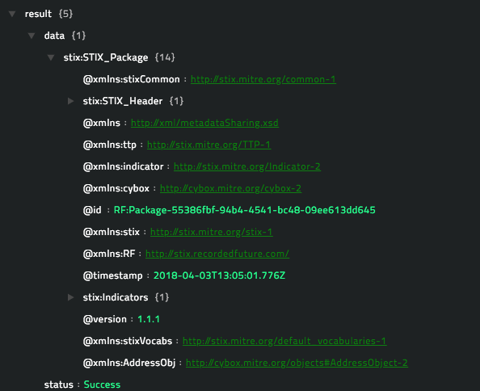

### operation: Search IP

**Note**: All the input parameters are optional. However, if you do not specify any parameter, then no filter criteria is applied and an unfiltered list is returned. 

#### Input parameters

| Parameter  | Description                                                  |
| ---------- | ------------------------------------------------------------ |
| Fields     | Fields that you want to include in the output. You can choose from the following options: Analysis Notes, Entity, Counts, Intel Card URL, Metrics, Related Entities, Risk, Sightings, Threat Lists, and Event Timestamps.    By default, this option is set as `Entity`. |
| Metadata   | Select this option to annotate the response with additional metadata explaining the response data elements.   By default, this option is set as `True`. |
| Limit      | Maximum number of results that this operation should return.    By default, this option is set as `10`. |
| From       | Records from offset.                                         |
| Range      | Range of IP addresses from starting IP address to ending IP address or CIDR.   For example, `1.2.3.4/24` or `1.2.3.4-5.6.7.8`. |
| Risk Score | Filter the search results by the risk score, which are integer values from 0 to 100.   For example, Risk Score=[20,90] // same as 20 <= Risk Score <= 90   Risk Score=(20,90) // same as 20 <= Risk Score <= 90   Risk Score=[20,90) // same as 20 <= Risk Score <= 90   Risk Score=[20,)   // same as 20 <= Risk Score  Risk Score=[,90)   // same as Risk Score < 90 |
| First Seen | Filter the search results by the first see date (all ElasticSearch compatible date formats are valid).   For example, 2017-03-14T18:01:18.750Z, 2017-01-01, 2017/01/01 |
| Last Seen  | Filter the search results by the last see date (all ElasticSearch compatible date formats are valid).   For example, 2017-03-14T18:01:18.750Z, 2017-01-01, 2017/01/01 |
| List ID    | Vulnerability ID from Recorded Future.   For example, ip:199.173.128.0/20 |
| Risk Rule  | Risk Rule List based on which you want to retrieve risk list information for IP address(es) from Recorded Future. You can choose from the following options: Historically Reported by Insikt Group, Inside Possible Bogus BGP Route, Historical Botnet Traffic, Nameserver for C&C Server, Historical C&C Server, Cyber Exploit Signal: Important, Cyber Exploit Signal: Medium, Recent Host of Many DDNS Names, Historically Reported as a Defanged IP, Resolution of Fast Flux DNS Name, Historically Reported in Threat List, Historical Honeypot Sighting, Honeypot Host, Recent C&C Server, Large, Historically Linked to Intrusion Method, Historically Linked to APT, Historically Linked to Cyber Attack, Malicious Packet Source, Malware Delivery, Historical Multicategory Blacklist, Historical Open Proxies, Phishing Host, Historical Positive Malware Verdict, Recently Reported by Insikt Group, Recent Botnet Traffic, Current C&C Server, Recently Reported as Defanged IP, Recent Honeypot Sighting, Recently Linked to Intrusion Method, Recently Linked to APT, Recently Linked to Cyber Attack, Recent Multicategory Blacklist, Recent Open Proxies, Recent Positive Malware Verdict, Recent Spam Source, Recent SSH/Dictionary Attacker, Recent Bad SSL Association, Recent Threat Researcher, Trending in Recorded Future Analyst Community, Historical Spam Source, Historical SSH/Dictionary Attacker, Historical Bad SSL Association, Historical Threat Researcher, Tor Node, Unusual IP, or Vulnerable Host. |
| Order By   | Order the search results by this filter criteria. You can choose from the following options: Created, Criticality, First Seen, Last Seen, Modified, Risk Score, Rules, Seven Days Hits, Sixty Days Hits, or Total Hits. |
| Direction  | Arrange the search results either in the  **Ascending** order or **Descending** order based on the risk score. |

#### Output

The JSON output contains information about intel threat context for all IP addresses or specific IP address(es) (based on the filter criteria you have specified) retrieved from Recorded Future.

Following image displays a sample output:

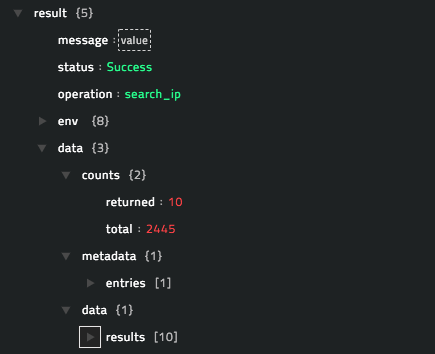

### operation: Get File Reputation

#### Input parameters

| Parameter | Description                                                  |
| --------- | ------------------------------------------------------------ |
| Filehash  | Filehash (MD5, SHA-1 or SHA-256) whose reputation you want to retrieve from Recorded Future. |
| Fields    | (Optional) Fields that you want to include in the output. You can choose from the following options: Analysis Notes, Entity, Counts, Intel Card URL, Metrics, Related Entities, Risk, Sightings, Threat Lists, and Event Timestamps.    By default, this option is set as `Entity`. |
| Metadata  | (Optional) Select this option to annotate the response with additional metadata explaining the response data elements.   By default, this option is set as `True`. |

#### Output

The JSON output contains the reputation information for the file retrieved from Recorded Future, based on the filehash you have specified.

Following image displays a sample output:

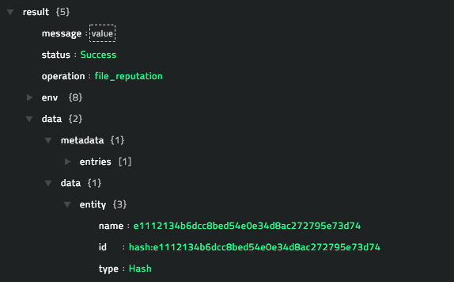

### operation: Get File Risk List

#### Input parameters

| Parameter      | Description                                                  |
| -------------- | ------------------------------------------------------------ |
| Risk Rule List | Risk Rule List based on which you want to retrieve risk list information for file(s) from Recorded Future. You can choose from the following options: Reported by Insikt Group, Historically Reported in Threat List, Linked to Cyber Attack, Linked to Malware, Linked to Attack Vector, Linked to Vulnerability, Malware SSL Certificate Fingerprint, Positive Malware Verdict, Trending in Recorded Future Analyst Community, or Threat Researcher. |

#### Output

The JSON output contains the risk list information for the file(s) retrieved from Recorded Future, based on the risk rule list you have specified.

Following image displays a sample output:

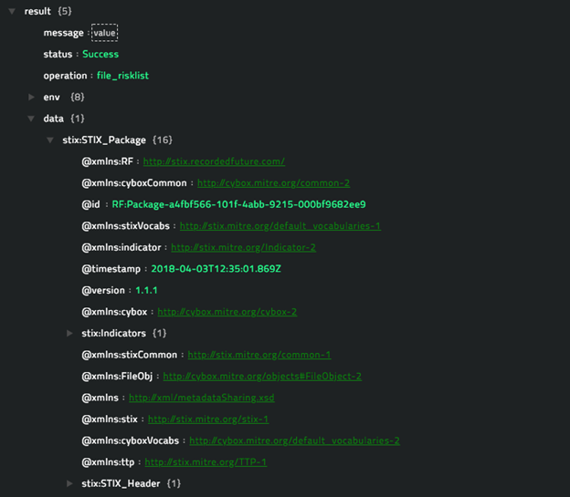

### operation: Search Filehash

**Note**: All the input parameters are optional. However, if you do not specify any parameter, then no filter criteria is applied and an unfiltered list is returned. 

#### Input parameters

| Parameter  | Description                                                  |
| ---------- | ------------------------------------------------------------ |
| Fields     | Fields that you want to include in the output. You can choose from the following options: Analysis Notes, Entity, Counts, Intel Card URL, Metrics, Related Entities, Risk, Sightings, Threat Lists, and Event Timestamps.    By default, this option is set as `Entity`. |
| Metadata   | Select this option to annotate the response with additional metadata explaining the response data elements.   By default, this option is set as `True`. |
| Limit      | Maximum number of results that this operation should return.    By default, this option is set as `10`. |
| From       | Records from offset.                                         |
| Risk Score | Filter the search results by the risk score, which are integer values from 0 to 100.   For example, Risk Score=[20,90] // same as 20 <= Risk Score <= 90   Risk Score=(20,90) // same as 20 <= Risk Score <= 90   Risk Score=[20,90) // same as 20 <= Risk Score <= 90   Risk Score=[20,)   // same as 20 <= Risk Score  Risk Score=[,90)   // same as Risk Score < 90 |
| Algorithm  | Filter the search results by the hash algorithm. You can choose from the following options: CRC-32, CTPH, MD5, SHA-1, SHA-256, or SHA-512. |
| First Seen | Filter the search results by the first see date (all ElasticSearch compatible date formats are valid).   For example, 2017-03-14T18:01:18.750Z, 2017-01-01, 2017/01/01 |
| Last Seen  | Filter the search results by the last see date (all ElasticSearch compatible date formats are valid).   For example, 2017-03-14T18:01:18.750Z, 2017-01-01, 2017/01/01 |
| List ID    | Vulnerability ID from Recorded Future.   For example, hash:1d724f95c61f1055f0d02c2154bbccd3 |
| Risk Rule  | Risk Rule List based on which you want to retrieve risk list information for filehash(es) from Recorded Future. You can choose from the following options: Reported by Insikt Group, Historically Reported in Threat List, Linked to Cyber Attack, Linked to Malware, Linked to Attack Vector, Linked to Vulnerability, Malware SSL Certificate Fingerprint, Positive Malware Verdict, Trending in Recorded Future Analyst Community, or Threat Researcher. |
| Order By   | Order the search results by this filter criteria. You can choose from the following options: Created, Criticality, First Seen, Last Seen, Modified, Risk Score, Rules, Seven Days Hits, Sixty Days Hits, or Total Hits. |
| Direction  | Arrange the search results either in the  **Ascending** order or **Descending** order based on the risk score. |

#### Output

The JSON output contains information about intel threat context for all filehashes or specific filehash(es) (based on the filter criteria you have specified) retrieved from Recorded Future.

Following image displays a sample output:

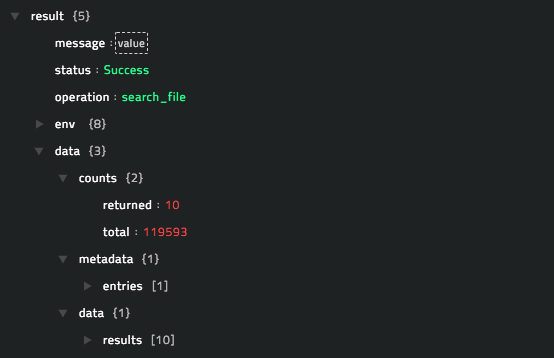

### operation: Lookup Vulnerability

#### Input parameters

| Parameter | Description                                                  |
| --------- | ------------------------------------------------------------ |
| CVE/RF ID | CVE Identifier ID or Recorded Future ID whose reputation you want to retrieve from Recorded Future.   For example CVE IDs: CVE-2018-8811, CVE-2018-8810   RF ID =  Vga53v |
| Fields    | (Optional) Fields that you want to include in the output. You can choose from the following options: National Vulnerability Database description, Analyst Notes, Common Names, Entity, Counts, Common Platform Enumeration, Common Platform Enumeration 2.2 URI, Common Vulnerability Scoring System, Intel Card URL, Metrics, Related Entities, Related Links, Risk, Sightings, Threat Lists, or Event Timestamps. |
| Metadata  | (Optional) Select this option to annotate the response with additional metadata explaining the response data elements.   By default, this option is set as `True`. |

#### Output

The JSON output contains intel threat context information for the vulnerability retrieved from Recorded Future, based on the CVE Identifier ID or Recorded Future ID you have specified.

Following image displays a sample output:

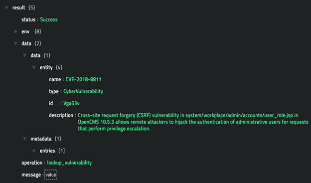

### operation: Get Vulnerability Risk List

#### Input parameters

| Parameter      | Description                                                  |
| -------------- | ------------------------------------------------------------ |
| Risk Rule List | Risk Rule List based on which you want to retrieve risk list information for vulnerability(ies) from Recorded Future. You can choose from the following options: Historically Reported by Insikt Group, Web Reporting Prior to CVSS Score, Cyber Exploit Signal: Critical, Cyber Exploit Signal: Important, Cyber Exploit Signal: Medium, Linked to Historical Cyber Exploit, Historically Linked to Exploit Kit, Historically Linked to Malware, Historically Linked to Remote Access Trojan, Historically Linked to Ransomware, Linked to Recent Cyber Exploit, Recently Linked to Exploit Kit, Recently Linked to Malware, Recently Linked to Remote Access Trojan, Recently Linked to Ransomware, NIST Severity: Critical, NIST Severity: High, NIST Severity: Low, NIST Severity: Medium, Web Reporting Prior to NVD Disclosure, Recently Reported by Insikt Group, Recently Linked to Penetration Testing Tools, or Historically Linked to Penetration Testing Tools. |

#### Output

The JSON output contains the risk list information for the vulnerability(ies) retrieved from Recorded Future, based on the risk rule list you have specified.

Following image displays a sample output:

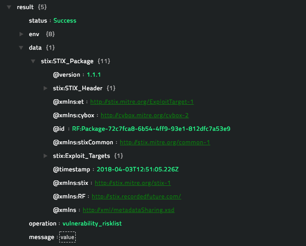

### operation: Search Vulnerabilities

**Note**: All the input parameters are optional. However, if you do not specify any parameter, then no filter criteria is applied and an unfiltered list is returned. 

#### Input parameters

| Parameter  | Description                                                  |
| ---------- | ------------------------------------------------------------ |
| Free Text  | Free text (not regex) string matching which list IDs are returned as the search result. |
| Fields     | Fields that you want to include in the output. You can choose from the following options: National Vulnerability Database description, Analyst Notes, Common Names, Entity, Counts, Common Platform Enumeration, Common Platform Enumeration 2.2 URI, Common Vulnerability Scoring System, Intel Card URL, Metrics, Related Entities, Related Links, Risk, Sightings, Threat Lists, or Event Timestamps. |
| Metadata   | Select this option to annotate the response with additional metadata explaining the response data elements.   By default, this option is set as `True`. |
| Limit      | Maximum number of results that this operation should return.    By default, this option is set as `10`. |
| From       | Records from offset.                                         |
| Risk Score | Filter the search results by the risk score, which are integer values from 0 to 100.   For example, Risk Score=[20,90] // same as 20 <= Risk Score <= 90   Risk Score=(20,90) // same as 20 <= Risk Score <= 90   Risk Score=[20,90) // same as 20 <= Risk Score <= 90   Risk Score=[20,)   // same as 20 <= Risk Score  Risk Score=[,90)   // same as Risk Score < 90 |
| CVSS Score | Filter the search results by the common vulnerability scoring system score (CVSS score).  You can enter a number between `0` to `10` as the CVSS score in the format `[0,10]`   For example, `[2,9.3]`, `(2,9.3)`, `[2,3.6)`, `(6,)`, `(,8)` . Working of the CVSS score examples is the same as the risk score examples. |
| First Seen | Filter the search results by the first see date (all ElasticSearch compatible date formats are valid).   For example, 2017-03-14T18:01:18.750Z, 2017-01-01, 2017/01/01 |
| Last Seen  | Filter the search results by the last see date (all ElasticSearch compatible date formats are valid).   For example, 2017-03-14T18:01:18.750Z, 2017-01-01, 2017/01/01 |
| List ID    | Vulnerability ID from Recorded Future.   For example, PGW3XH |
| Risk Rule  | Risk Rule List based on which you want to retrieve risk list information for vulnerability(ies) from Recorded Future. You can choose from the following options: Historically Reported by Insikt Group, Web Reporting Prior to CVSS Score, Cyber Exploit Signal: Critical, Cyber Exploit Signal: Important, Cyber Exploit Signal: Medium, Large, Linked to Historical Cyber Exploit, Historically Linked to Exploit Kit, Historically Linked to Malware, Historically Linked to Remote Access Trojan, Historically Linked to Ransomware, Linked to Recent Cyber Exploit, Recently Linked to Exploit Kit, Recently Linked to Malware, Recently Linked to Remote Access Trojan, Recently Linked to Ransomware, NIST Severity: Critical, NIST Severity: High, NIST Severity: Low, NIST Severity: Medium, Web Reporting Prior to NVD Disclosure, Recently Reported by Insikt Group, Recently Linked to Penetration Testing Tools, or Historically Linked to Penetration Testing Tools. |
| Order By   | Order the search results by this filter criteria. You can choose from the following options: Created, Criticality, First Seen, Last Seen, Modified, Risk Score, Rules, Seven Days Hits, Sixty Days Hits, or Total Hits. |
| Direction  | Arrange the search results either in the  **Ascending** order or **Descending** order based on the risk score. |

#### Output

The JSON output contains information about intel threat context for all vulnerabilities or specific vulnerability(ies) (based on the filter criteria you have specified) retrieved from Recorded Future.

Following image displays a sample output:

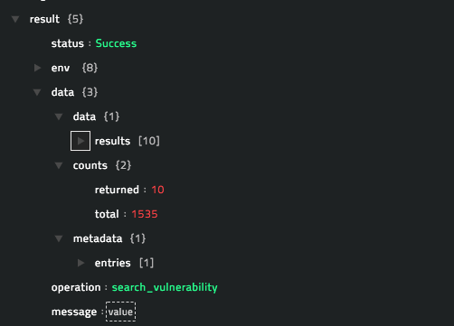

### operation: Lookup URL

#### Input parameters

| Parameter | Description                                                  |
| --------- | ------------------------------------------------------------ |
| URL       | URL for which you want to retrieve threat information from Recorded Future. |
| Fields    | (Optional) Fields that you want to include in the output. You can choose from the following options: Analyst Notes, Entity, Counts, Metrics, Related Entities, Risk, Sightings, or Event Timestamps. |
| Metadata  | (Optional) Select this option to annotate the response with additional metadata explaining the response data elements.   By default, this option is set as `True`. |

#### Output

The JSON output contains intel threat context information for the URL retrieved from Recorded Future, based on the URL you have specified.

Following image displays a sample output:

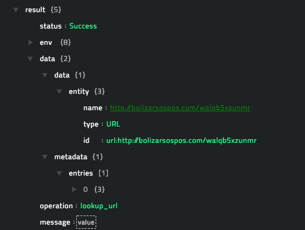

### operation: Get URL Risk List

#### Input parameters

| Parameter      | Description                                                  |
| -------------- | ------------------------------------------------------------ |
| Risk Rule List | Risk Rule List based on which you want to retrieve risk list information for URL(s) from Recorded Future. You can choose from the following options: C&C URL, Compromised URL, Historically Reported as a Defanged URL, Historically Reported in Threat List, Large, Active Phishing URL, Ransomware Distribution URL, or Recently Reported as e Defanged URL. |

#### Output

The JSON output contains the risk list information for the URL(s) retrieved from Recorded Future, based on the risk rule list you have specified.

Following image displays a sample output:

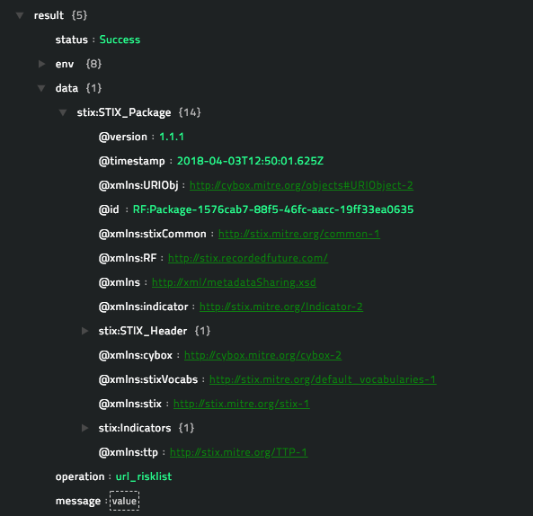

### operation: Search URL

**Note**: All the input parameters are optional. However, if you do not specify any parameter, then no filter criteria is applied and an unfiltered list is returned. 

#### Input parameters

| Parameter  | Description                                                  |
| ---------- | ------------------------------------------------------------ |
| Fields     | Fields that you want to include in the output. You can choose from the following options: Analyst Notes, Entity, Counts, Metrics, Related Entities, Risk, Sightings, or Event Timestamps. |
| Metadata   | Select this option to annotate the response with additional metadata explaining the response data elements.   By default, this option is set as `True`. |
| Limit      | Maximum number of results that this operation should return.    By default, this option is set as `10`. |
| From       | Records from offset.                                         |
| Risk Score | Filter the search results by the risk score, which are integer values from 0 to 100.   For example, Risk Score=[20,90] // same as 20 <= Risk Score <= 90   Risk Score=(20,90) // same as 20 <= Risk Score <= 90   Risk Score=[20,90) // same as 20 <= Risk Score <= 90   Risk Score=[20,)   // same as 20 <= Risk Score  Risk Score=[,90)   // same as Risk Score < 90 |
| First Seen | Filter the search results by the first see date (all ElasticSearch compatible date formats are valid).   For example, 2017-03-14T18:01:18.750Z, 2017-01-01, 2017/01/01 |
| Last Seen  | Filter the search results by the last see date (all ElasticSearch compatible date formats are valid).   For example, 2017-03-14T18:01:18.750Z, 2017-01-01, 2017/01/01 |
| List ID    | Vulnerability ID from Recorded Future.   For example, url:http://examplendv.com/niugufvt4 |
| Risk Rule  | Risk Rule List based on which you want to retrieve risk list information for URL(s) from Recorded Future. You can choose from the following options: C&C URL, Compromised URL, Historically Reported as a Defanged URL, Historically Reported in Threat List, Active Phishing URL, Ransomware Distribution URL, or Recently Reported as e Defanged URL. |
| Order By   | Order the search results by this filter criteria. You can choose from the following options: Created, Criticality, First Seen, Last Seen, Modified, Risk Score, Rules, Seven Days Hits, Sixty Days Hits, or Total Hits. |
| Direction  | Arrange the search results either in the  **Ascending** order or **Descending** order based on the risk score. |

#### Output

The JSON output contains information about intel threat context for all URLs or specific URL(s) (based on the filter criteria you have specified) retrieved from Recorded Future.

Following image displays a sample output:

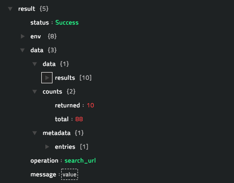

### operation: Lookup Malware

#### Input parameters

| Parameter | Description                                                  |
| --------- | ------------------------------------------------------------ |
| ID        | ID of the Malware for which you want to retrieve threat information from Recorded Future. |
| Fields    | (Optional) Fields that you want to include in the output. You can choose from the following options: Analyst Notes, Entity, Counts, Metrics, Intel Card URL, Related Entities, Sightings, Categories, or Event Timestamps. |
| Metadata  | (Optional) Select this option to annotate the response with additional metadata explaining the response data elements.   By default, this option is set as `True`. |

#### Output

The JSON output contains intel threat context information for the Malware retrieved from Recorded Future, based on the Malware ID you have specified.

Following image displays a sample output:

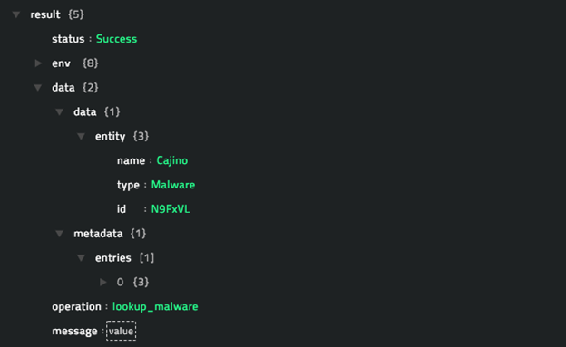

### operation: Search Malware

**Note**: All the input parameters are optional. However, if you do not specify any parameter, then no filter criteria is applied and an unfiltered list is returned. 

#### Input parameters

| Parameter  | Description                                                  |
| ---------- | ------------------------------------------------------------ |
| Free Text  | Free text (not regex) string matching which list IDs are returned as the search result. |
| Fields     | Fields that you want to include in the output. You can choose from the following options: Analyst Notes, Entity, Counts, Metrics, Intel Card URL, Related Entities, Sightings, Categories, or Event Timestamps. |
| Metadata   | Select this option to annotate the response with additional metadata explaining the response data elements.   By default, this option is set as `True`. |
| Limit      | Maximum number of results that this operation should return.    By default, this option is set as `10`. |
| From       | Records from offset.                                         |
| First Seen | Filter the search results by the first see date (all ElasticSearch compatible date formats are valid).   For example, 2017-03-14T18:01:18.750Z, 2017-01-01, 2017/01/01 |
| Last Seen  | Filter the search results by the last see date (all ElasticSearch compatible date formats are valid).   For example, 2017-03-14T18:01:18.750Z, 2017-01-01, 2017/01/01 |
| List ID    | Vulnerability ID from Recorded Future.   For example, Ps4Y1A |
| Order By   | Order the search results by this filter criteria. You can choose from the following options: Created, Criticality, First Seen, Last Seen, Modified, Risk Score, Rules, Seven Days Hits, Sixty Days Hits, or Total Hits. |
| Direction  | Arrange the search results either in the  **Ascending** order or **Descending** order based on metrics (counts of recent references and metric values for various risk rules). |

#### Output

The JSON output contains information about intel threat context for all Malwares or specific Malware(s) (based on the filter criteria you have specified) retrieved from Recorded Future.

Following image displays a sample output:

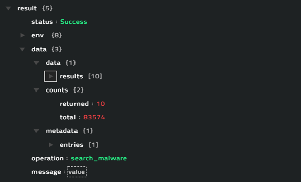

### operation: Get Alert

#### Input parameters

| Parameter | Description                                                  |
| --------- | ------------------------------------------------------------ |
| ID        | ID of the alert generated on Recorded Future for which you want to retrieve information from Recorded Future. |

#### Output

The JSON output contains details for the alert retrieved from Recorded Future, based on the alert ID you have specified.

### operation: Search Alerts

**Note**: All the input parameters are optional. However, if you do not specify any parameter, then no filter criteria is applied and an unfiltered list is returned. 

#### Input parameters

| Parameter     | Description                                                  |
| ------------- | ------------------------------------------------------------ |
| Triggered     | DateTime when the alert was generated on Recorded Future. All Elasticsearch compatible date formats are valid.   Relative time expressions are also supported, such as -2d for two days prior to today and yesterday. As with absolute time references, both ends of the range still need to be specified.  For example, to search for alerts that fired within the last 24 hrs, use `triggered = [-24h,]`. |
| Assignee      | Filter the search results by the name of the assignee to whom the alert was assigned in Recorded Future, using the email address associated with that user account. |
| Status        | Status of the alert. You can choose from the following options: Unassigned, Assigned, Actionable, No Action, or Tuning. |
| Alert Rule ID | Recorded Future's Alert Rule ID that is associated with the alert notification. |
| Free Text     | Free text (not regex) string matching which list IDs are returned as the search result. |
| Limit         | Maximum number of results that this operation should return.    By default, this option is set as `10`. |
| From          | Records from offset.                                         |
| List ID       | Vulnerability ID from Recorded Future.   For example, Ps4Y1A |
| Order By      | Order the search results by this filter criteria. Currently only the Triggered option is available. |
| Direction     | Arrange the search results either in the  **Ascending** order or **Descending** order. |

#### Output

The JSON output contains information about all Alerts or specific Alert(s) (based on the filter criteria you have specified) retrieved from Recorded Future.

Following image displays a sample output:

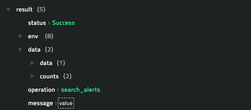

### operation: Search Alert Rules

**Note**: All the input parameters are optional. However, if you do not specify any parameter, then no filter criteria is applied and an unfiltered list is returned. 

#### Input parameters

| Parameter     | Description                                                  |
| ------------- | ------------------------------------------------------------ |
| Free Text     | Free text (not regex) string matching which list IDs are returned as the search result. |
| Limit         | Maximum number of results that this operation should return.    By default, this option is set as `10`. |

#### Output

The JSON output contains information about all Alert Rules or specific Alert Rule(s) (based on the filter criteria you have specified) retrieved  from Recorded Future.

Following image displays a sample output:

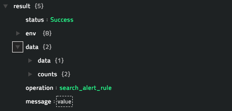

### operation: Get Risk Rules

#### Input parameters

| Parameter      | Description                                                  |
| -------------- | ------------------------------------------------------------ |
| Risk Rules for | Risk rules have to be retrieved for the selected input from Recorded Future. You can choose from the following options: IP, Domain, URL, File, or Vulnerability. |

#### Output

The JSON output contains information about the risk rules for  IP, Domain, URL, File, or Vulnerability (based on the filter criteria you have specified) retrieved from Recorded Future.

Following image displays a sample output:

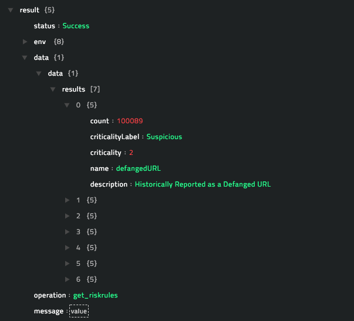

## Included playbooks

The `Sample - Recorded-Future - 1.0.0`  playbook collection comes bundled with the Recorded Future connector. This playbook contains steps using which you can perform all supported actions. You can see the bundled playbooks in the **Automation** > **Playbooks** section in CyOPs™ after importing the Recorded Future connector.

- Domain : Get Domain Reputation
- Domain : Get Domain Risk List
- Domain : Search Domain
- File : Get File Reputation
- File : Get File Risk List
- File : Search Filehash
- Get Alert
- Get Risk Rules
- IP : Get IP Reputation
- IP : Get IP Risk List
- IP : Search IP Addresses
- Malware : Lookup Malware
- Malware : Search Malware
- Search Alert Rules
- Search Alerts
- URL : Get URL Risk List
- URL : Lookup URL
- URL : Search URL
- Vulnerability : Get Vulnerability Risk List
- Vulnerability : Lookup Vulnerability
- Vulnerability : Search Vulnerabilities

**Note**: If you are planning to use any of the sample playbooks in your environment, ensure that you clone those playbooks and move them to a different collection, since the sample playbook collection gets deleted during connector upgrade and delete.

